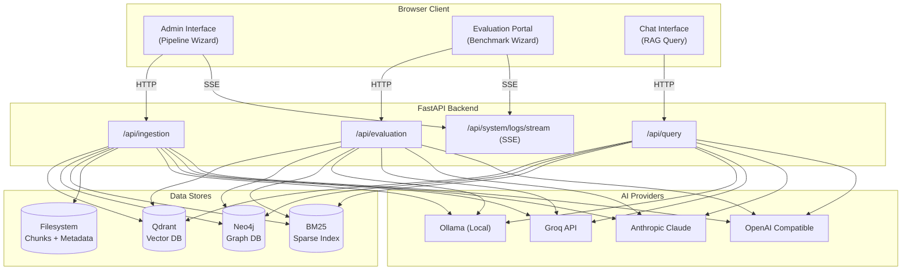
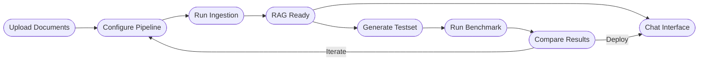
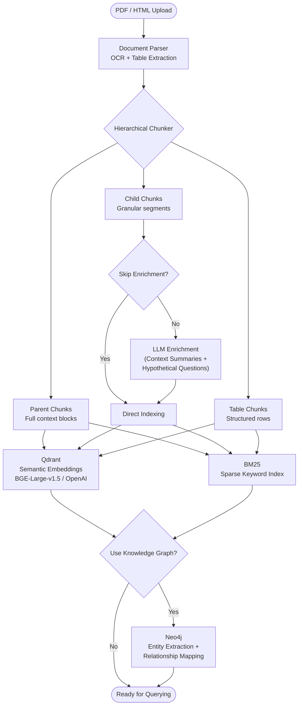
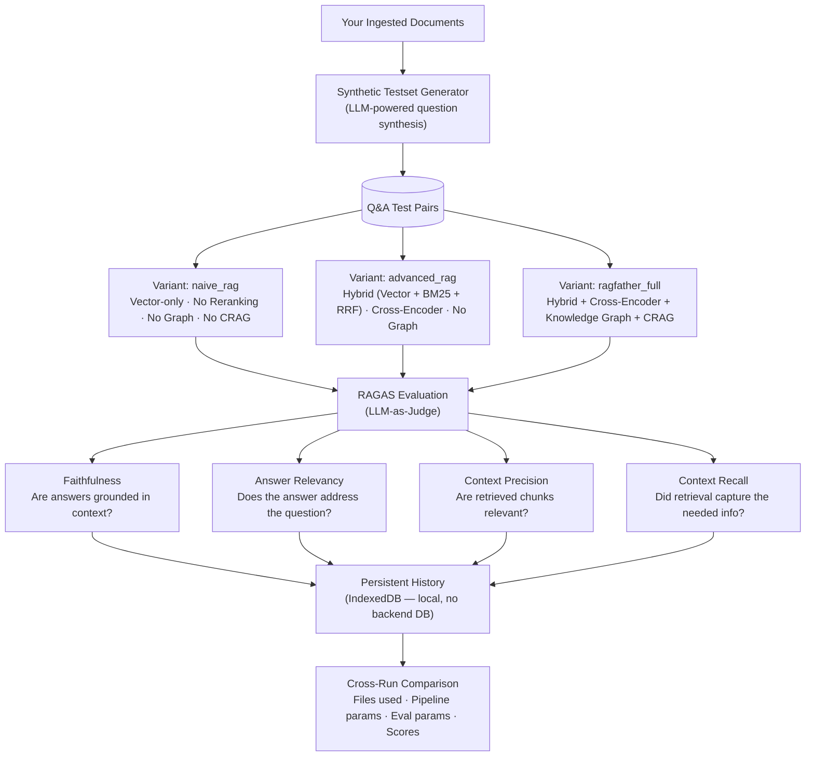
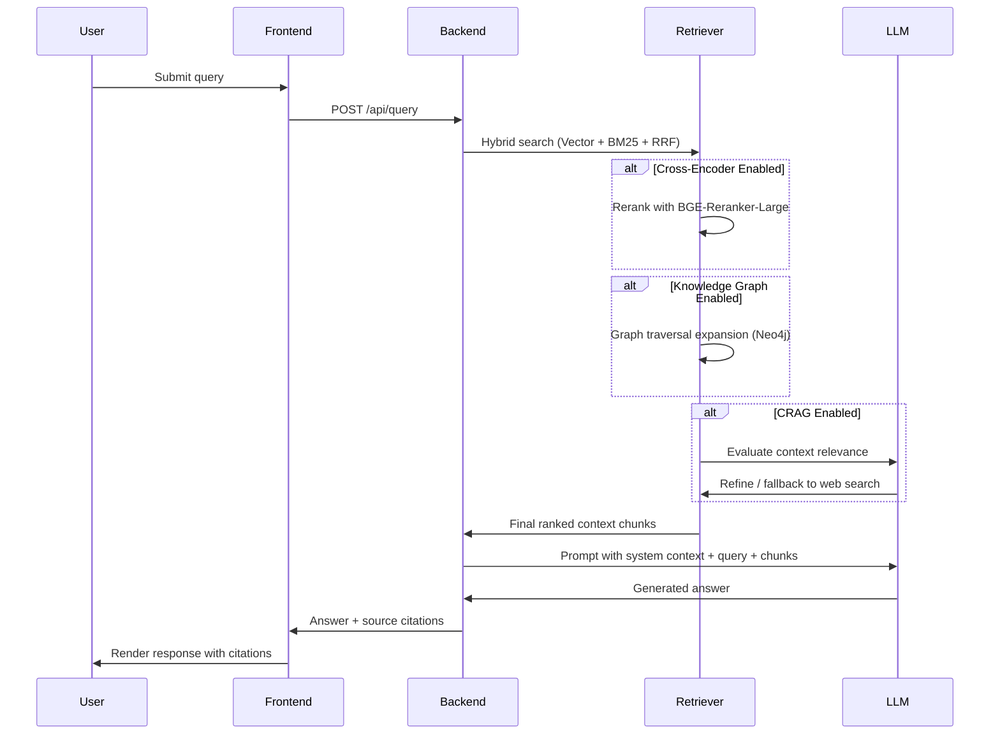

<div align="center">

# Ragfather

**The Godfather of RAG Pipelines**

*Build. Evaluate. Deploy. Own your AI, completely.*

[](https://python.org)
[](https://fastapi.tiangolo.com)
[](https://react.dev)
[](https://qdrant.tech)
[](https://neo4j.com)
[](LICENSE)

</div>

---

## Demo

<div align="center">
  <video src="./assets/demo.mp4" width="100%" controls autoplay loop muted playsinline>
    Your browser does not support the video tag.
  </video>
</div>

---

## What is Ragfather?

Ragfather is an **end-to-end, self-hosted RAG creation, evaluation, and deployment platform**. It gives you complete ownership over every stage of the RAG lifecycle — from raw document ingestion and multi-index storage, through rigorous automated evaluation, all the way to production-ready querying — without requiring a single external API call.

Unlike generic RAG starter kits, Ragfather is designed for **experimentation and precision**. You can toggle individual pipeline components on and off, run head-to-head ablation studies across multiple retrieval strategies, and use the built-in evaluation suite to identify the optimal configuration for *your* specific data and use case. Every parameter is exposed. Every result is traceable.

---

## Key Features

| Feature | Description |
| :--- | :--- |
| **End-to-End Pipeline** | Upload PDFs → Chunk → Enrich → Index → Query. All via a web UI. |
| **Total Customization** | Toggle Knowledge Graph, Cross-Encoder Reranking, CRAG, Skip Enrichment, Append vs. Wipe modes, Top-K, chunk sizes and more. |
| **Built-in Evaluation Suite** | Auto-generate synthetic test sets from your own documents and benchmark multiple RAG strategies side-by-side. |
| **RAGAS Scoring** | Judge retrieval quality on Faithfulness, Answer Relevancy, Context Precision, and Context Recall. |
| **Evaluation History** | Every benchmark run is persisted locally (IndexedDB) with full pipeline parameters, so you can compare runs across time and select your best configuration. |
| **Fully Local-First** | Ollama integration means zero data leaves your machine. Groq, Claude, and OpenAI-compatible APIs are optional. |
| **No Framework Lock-in** | Built with raw FastAPI, LiteLLM, and direct database clients for maximum control, debuggability, and zero black-box abstraction overhead. |
| **Real-time Logs** | Live streaming execution logs via SSE directly in the browser terminal UI. |

---

## System Architecture



---

## Complete Workflow



---

## Pipeline Deep Dive

The ingestion pipeline transforms raw documents into a richly-indexed, multi-modal knowledge base.



### Pipeline Parameters You Control

| Parameter | Options | Effect |
| :--- | :--- | :--- |
| **Wipe Data on Run** | On / Off | Full rebuild vs. append to existing index |
| **Skip Enrichment** | On / Off | Skip LLM context generation for faster ingestion |
| **Knowledge Graph** | On / Off | Enable Neo4j entity extraction and multi-hop traversal |
| **Cross-Encoder Reranker** | On / Off | Second-pass neural reranking of retrieved results |
| **Enrichment Provider** | Ollama, Groq, Claude, Custom | LLM used for contextual enrichment |
| **Generation Provider** | Ollama, Groq, Claude, Custom | LLM used for answer synthesis |
| **Embedding Provider** | Local (BGE-Large), OpenAI | Embedding model for vector indexing |
| **Child Chunk Size** | Integer | Granularity of indexable segments |
| **Top-K Retrieval** | Integer | Number of candidates fetched pre-rerank |
| **Graph Hops** | Integer | Depth of graph traversal from seed nodes |

---

## Evaluation Portal

Ragfather includes a first-class **evaluation and ablation framework**. Instead of blindly tuning parameters, you can quantitatively compare how different RAG configurations perform on questions *derived from your own documents*.



### Evaluation Variants

| Variant | Description |
| :--- | :--- |
| `naive_rag` | Baseline vector-only retrieval. No hybrid search, no reranking, no graph, no CRAG. |
| `advanced_rag` | Hybrid retrieval (Vector + BM25 + RRF fusion) with Cross-Encoder reranking. |
| `ragfather_full` | Full system: hybrid retrieval + Cross-Encoder + Knowledge Graph expansion + CRAG loop. |

### Evaluation History

Every benchmark run is automatically saved to the browser's local **IndexedDB**. This gives you a permanent, queryable log of every experiment:
- Which files were ingested
- Exact pipeline configuration at time of training
- Eval parameters (variants run, question subset, RAGAS settings)
- All RAGAS scores in an easy-to-compare table

> **Note:** To reproduce a specific result, you must re-ingest using the same pipeline parameters shown in the history entry.

---

## Chat Interface



---

## Quick Start

### Prerequisites

- **Docker & Docker Compose** — for orchestrating all services
- **Ollama** (optional but recommended) — for fully local, private LLM inference

> **Ollama setup note:** By default, Ollama binds to `localhost` only. For Docker container access, you must expose it on all interfaces:
> ```bash
> # Linux (systemd)
> sudo systemctl edit ollama --force
> # Add: Environment="OLLAMA_HOST=0.0.0.0"
> sudo systemctl restart ollama
> ```

### 1. Clone & Configure

```bash
git clone https://github.com/your-org/rag-father.git
cd rag-father
cp .env.example .env
# Edit .env and fill in your provider keys (if not using Ollama locally)
```

### 2. Pull Required Models

```bash
ollama pull qwen2.5:7b # Enrichment + Generation (default)
ollama pull bge-large:latest # Embeddings
```

### 3. Start the Stack

```bash
docker compose up --build -d
```

### 4. Open the App

| Interface | URL |
| :--- | :--- |
| Chat | `http://localhost:3000` |
| Admin (Pipeline) | `http://localhost:3000/admin` |
| Evaluation Portal | `http://localhost:3000/evaluate` |

---

## Project Structure

```
rag-father/
├── ragfather/
│ ├── api/ # FastAPI routes (ingestion, evaluation, query, system)
│ ├── ingestion/ # PDF parsing, chunking, enrichment
│ ├── indexing/ # Qdrant, Neo4j, BM25 indexing logic
│ ├── retrieval/ # Hybrid retriever, vector retriever, graph retriever
│ ├── generation/ # LLM answer synthesis (LiteLLM wrapper)
│ ├── evaluation/ # Benchmark runner, RAGAS integration, synthetic data gen
│ ├── query/ # Full query orchestrator (CRAG, retrieval, generation)
│ └── config.py # Central configuration schema
├── frontend/ # React + Vite + TailwindCSS web application
│ └── src/
│ ├── pages/
│ │ ├── AdminInterface.jsx # 4-step pipeline wizard
│ │ ├── EvaluationInterface.jsx # 3-step evaluation wizard + history
│ │ └── ChatInterface.jsx # Conversational RAG interface
│ └── utils/
│ └── db.js # IndexedDB persistence layer
├── data/
│ ├── raw/ # Uploaded source documents
│ ├── processed/ # Chunked data
│ └── eval/ # Synthetic Q&A testsets + benchmark results
├── docker-compose.yml
├── Dockerfile.backend
└── .env.example
```

---

## Service Architecture

| Service | Technology | Port | Purpose |
| :--- | :--- | :--- | :--- |
| **frontend** | React + Vite + Nginx | `3000` | Web UI. Reverse proxies API calls to backend. |
| **backend** | FastAPI (Python 3.11) | `8000` | Ingestion orchestration, query execution, eval runner. |
| **qdrant** | Qdrant | `6333` | High-performance vector database. |
| **neo4j** | Neo4j 5 | `7474` (HTTP), `7687` (Bolt) | Knowledge graph storage and traversal. |

---

## Why No LangChain?

Ragfather is built intentionally **without** LangChain, LlamaIndex, or LangGraph. This is a feature, not an oversight.

1. **Ablation control** — Toggling individual pipeline components (graph, reranker, CRAG) dynamically is far cleaner without static chain abstractions.
2. **Evaluation transparency** — RAGAS requires exact access to intermediate pipeline states (the specific context chunks passed to the LLM). Custom code makes this trivial.
3. **Prompt ownership** — Knowledge graph entity extraction uses hand-tuned prompts. Avoiding `LLMGraphTransformer` means absolute schema control.
4. **Debugging speed** — No unpacking opaque `RunnableSequence` objects. What you write is what runs.

---

## Contributing

Contributions are welcome! Please open an issue to discuss your proposed change before submitting a PR. Make sure to update relevant documentation and add tests where applicable.

---

## License

MIT License — see [LICENSE](LICENSE) for details.