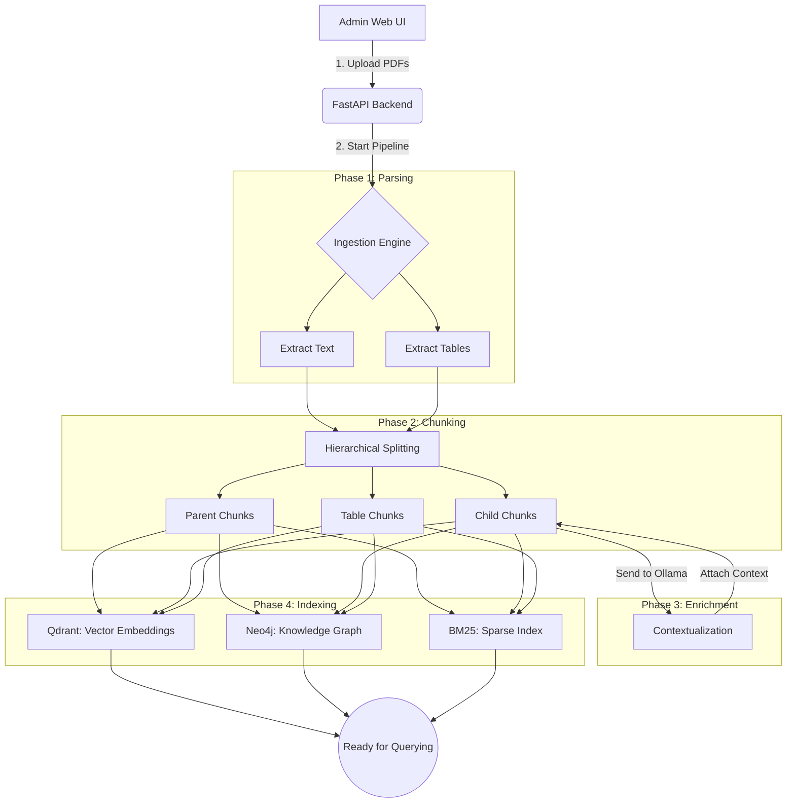

# Rag-Father: Self-Service Legal GraphRAG

## 1. Overview
Rag-Father is a containerized, self-service Retrieval-Augmented Generation (RAG) system specialized for legal and structural documents. It provides an end-to-end pipeline that allows users to upload raw PDF documents via a web interface, automatically chunks and enriches the text, and stores the data across dual databases (Vector and Graph). The system then provides a conversational interface to query the ingested documents with high precision, utilizing local LLMs for data privacy and security.

## 2. Prerequisites
Before running the system, ensure the following dependencies are installed and running on your host machine:

* **Docker & Docker Compose**: Required for orchestrating the frontend, backend, and databases.
* **Ollama**: Must be installed and running locally. The system communicates with Ollama via the Docker host-gateway to perform contextual enrichment and answer generation. Ensure your target models (e.g., `qwen2.5:7b`) are pulled and available.
  * **CRITICAL**: By default, Ollama only listens on `localhost` (`127.0.0.1`), which blocks Docker containers from accessing it. You **MUST** configure your Ollama system service to listen on all interfaces by setting the environment variable `OLLAMA_HOST=0.0.0.0`.

## 3. System Pipeline

The data ingestion and retrieval workflow is fully automated. Below is the hierarchical breakdown of the pipeline lifecycle.



### Pipeline Breakdown
1. **Document Parsing**: Ingests raw PDFs and HTML files, utilizing optical character recognition (OCR) and lattice-based table extraction to capture both unstructured text and structured tabular data.
2. **Hierarchical Chunking**: Splits large documents into smaller, logical segments while maintaining parent-child structural relationships to preserve the original document context.
3. **Contextual Enrichment**: Passes child chunks to the local Ollama LLM to generate synthetic context summaries, significantly improving retrieval accuracy for isolated clauses.
4. **Multi-Index Storage**:
    * **Semantic Vectors**: Embeds chunks using Sentence-Transformers and stores them in Qdrant for semantic similarity searches.
    * **Knowledge Graph**: Maps chunk relationships, source documents, and metadata into Neo4j nodes and edges for structural traversal.
    * **Sparse Index**: Builds a BM25 index for exact keyword matching.

## 4. Why Not LangChain?

While frameworks like LangChain, LlamaIndex, or LangGraph provide excellent abstractions for standard RAG pipelines, Rag-Father was deliberately built using custom python implementations (FastAPI, LiteLLM, raw database clients). This architectural decision was made for the following reasons:

1. **Ablation Testing Control**: The Evaluation Portal allows users to dynamically toggle pipeline components (e.g., Naive vs. Advanced RAG). Managing dynamic routing and modular toggles is significantly easier without fighting static chain abstractions (like LCEL).
2. **Evaluation Data Extraction**: Frameworks like RAGAS require exact references to intermediate states (the specific context chunks passed to the LLM). Custom logic allows us to easily capture these intermediate states without unpacking complex framework-specific object wrappers.
3. **Transparent Prompts**: Core logic like the GraphRAG extraction relies on our own specialized, heavily-tuned system prompts. By avoiding "black box" abstractions like `LLMGraphTransformer`, we maintain absolute control over the schema and quality of our Graph Database.
4. **Performance & Debugging**: Removing heavy abstraction layers results in a leaner codebase that is faster to execute and significantly easier to debug when pipeline traces fail.

## 5. Architecture and Containers

The system is deployed via Docker Compose and consists of four isolated services communicating over a shared network.

| Service | Technology | Port | Purpose |
| :--- | :--- | :--- | :--- |
| **frontend** | React + Nginx | `3000` | Serves the Admin UI and Chatbot interface. Acts as a reverse proxy routing API calls to the backend. |
| **backend** | FastAPI (Python) | `8000` | Orchestrates the ingestion pipeline, manages file uploads, and handles RAG query execution. |
| **qdrant** | Qdrant | `6333` | High-performance vector database storing chunk embeddings. |
| **neo4j** | Neo4j | `7474` (HTTP)<br>`7687` (Bolt) | Graph database storing structural relationships between documents and clauses. |

## 6. Setup and Execution

Follow these steps to deploy and use the system:

1. **Verify Ollama**
Ensure the Ollama daemon is active on your host machine and listening on all interfaces (`OLLAMA_HOST=0.0.0.0`).

2. **Deploy the Stack**
Navigate to the root directory of the repository and build the Docker containers:
```bash
docker compose up --build -d
```

3. **Access the Application**
Once the containers are running, open your web browser and navigate to:
```
http://localhost:3000
```

4. **Ingest Documents**
* Use the **Admin UI** to upload your raw PDF files.
* Click **Start Pipeline**. You can monitor the real-time execution logs in the UI terminal.
* To create a new knowledge base, click **Reset System** to wipe the active directories, then upload new files and rerun the pipeline.

5. **Query the System**
Switch to the Chat Interface in the UI to begin querying your newly ingested documents.